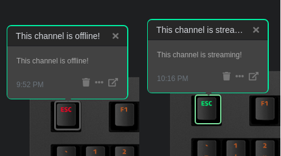

# Q Applet: Youtube Livestream Status

Displays the status of your chosen youtuber as a colour on your keyboard.
This program was built to monitor vtubers and I have no shame in admitting that.

[GitLab repository](https://gitlab.legitcorp.com/daskeyboard/youtubelivestreamstatus)

## Example

## Changelog

[CHANGELOG.MD](CHANGELOG.md)

## Installation

Requires a Das Keyboard Q Series: www.daskeyboard.com

Installation, configuration and uninstallation of applets is done within
the Q Desktop application (<https://www.daskeyboard.com/q>)

## Running tests

- `I didn't write any tests because I don't know how.`

## Contributions

Please help me I have no idea what I'm doing.

## Corporate jargon

Copyleft 2020 [Legitcorp](legitcorp.com/).
If you like anime join [my cult](https://axisorder.com/).
